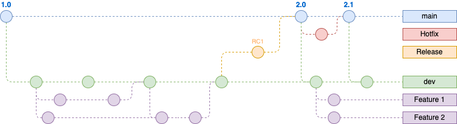

# PROYECTO FINAL GRUPO Devops11A - KEEPCODING CLOUD DEVOPS 11

Proyecto final del grupo Devops11A para el bootcamp **Devops & Cloud Computing - Edición XI**.

## TABLA DE CONTENIDOS

- [Descripción](#descripción)  
- [Recursos](#recursos)  
- [Video explicativo](#video-explicativo)  
- [Desarrollo y construcción de la imagen de la aplicación](#desarrollo-y-construcción-de-la-imagen-de-la-aplicación)
  - [Gitflow](#gitflow)  
  - [Preparación para desarrollo](#preparación-para-desarrollo)  
  - [Push de la rama](#push-de-la-rama)  
  - [PR a dev](#pr-a-dev)
  - [CircleCI pipeline en dev](#circleci-pipeline-en-dev)
  - [PR en main](#pr-en-main)
  - [Github Actions pipeline en main](#github-actions-pipeline-en-main)
- [Despliegue de la aplicación en local](#despliegue-de-la-aplicación-en-local)
  - [Clonación del proyecto](#clonación-del-proyecto)
  - [Despliegue automático](#despliegue-automático)
  - [Acceso a la aplicación](#acceso-a-la-aplicación)

## DESCRIPCIÓN

Este es el repositorio central para el proyecto final del grupo Devops11A del bootcamp **Devops & Cloud Computing - Edición XI**, en el cual se despliega una aplicación *Flask* conectada a una base de datos *Redis* y *ElasticSearch* para guardar los logs.  

Se han preparado tres tipos de despliegues:

- Despliegue local para realizar desarrollo, a través de una configuración para vscode, usando **docker-compose**, que además despliega un servicio *Kibana*.  
- Despliegue en local usando manifiestos de *Kubernetes* en una infraestructura local con *Kind* usando *ArgoCD*.  
- Despliegue en **Google Cloud** usando manifiestos de **Terraform** usando Infraestructura como código.  

La aplicación *Flask* muestra un texto con el número de veces que se ha cargado la página principal de la aplicación. Además, se han creado dos endpoints para mostrar los logs `/logs` y el estado de la aplicación, `/health`. La aplicación tiene un indexado para hacer un trace de los logs y poder gestionarlo en el servicio *Kibana*. La imagen de la aplicación *Flask* está en el repositorio de Github del proyecto ([*Github*](https://github.com/juarru/devops11a-project-app/pkgs/container/devops11a-project-app)).

El servicio de la base de datos *Redis*, sirve como persistencia del número de veces que se visita la página principal de la aplicación.

El servicio *ElasticSearch* guarda los logs que se van generando, para, posteriormente, poder trabajar con ellos en el servicio *Kibana*.

A través de *Kind* creamos un cluster local de Kubernetes, que nos permitirá desplegar de manera automática la herramienta *ArgoCD* para la entrega continua de despliegues de *Kubernetes*, y la aplicación *Flask* ya desplegada, a través de un fichero *bash* `install.sh`. También se despliegan los servicios *Kibana*, *Prometheus* y *Grafana*.

## RECURSOS

La práctica está compuesta de los siguientes repositorios y proyectos:

- Repositorio del código de la aplicación y despliegue en la nube -> <https://github.com/juarru/devops11a-project-app>  
- Repositorio de los artefactos de la release -> <https://github.com/juarru/devops11a-project-app/releases>  
- Repositorio de las imágenes generadas -> <https://github.com/juarru/devops11a-project-app/pkgs/container/devops11a-project-app>
- Proyecto de CircleCI -> <https://app.circleci.com/pipelines/github/juarru/devops11a-project-app>
- Proyecto de Codecov -> <https://app.codecov.io/gh/juarru/devops11a-project-app>
- Proyecto de Sonarqube -> <https://sonarcloud.io/summary/new_code?id=juarru_devops11a-project-app&branch=main>
- Repositorio de la infraestructura de despliegue local-> <https://github.com/juarru/devops11a-project-local-deploy#>  

> **Nota:** En el `README.md` del repositorio de código y del repositorio de infraestructura, se encontrarán las instrucciones para su uso.

## VIDEO EXPLICATIVO

Aquí se puede encontrar el video explicativo de la práctica -> <https://www.loom.com/share/226325609bde4fbc825b7f40e0fb5610?sid=e9ab2c61-aa48-4b8f-b504-842a22025cd8>

## DESARROLLO Y CONSTRUCCIÓN DE LA IMAGEN DE LA APLICACIÓN

### Gitflow

Se ha establecido el proyecto para realizar un *Gitflow* simple, con una rama principal **main** y una rama de desarrollo - pruebas **dev**.



El Desarrollador debe de sacar una rama de **dev** con un nombre indicativo de la tarea a realizar, donde realizará las acciones oportunas.

Una vez el Desarrollador termine el trabajo, subirá la rama al repositorio y abrirá un *Pull Request* de la rama subida **sobre la rama dev** en el *repositorio de Github* de manera manual.  

Al realizar el *Pull Request* se activarán unas *Github Actions* que realizarán unos checks de linting, testeo, para poder mergear con seguridad a la rama *dev*.

Una vez realizado este mergeo, se lanzarán unos checks de linting, testeo y cobertura en un pipeline de *CircleCI*.

Cuando se quiera desplegar a producción, se realizará de manera manual en el *repositorio de Github*, un *Pull Request* **de la rama dev sobre la rama main**. En este *Pull Request* nos aparecerán los checks que se realizaron con *CircleCI*, y se volverán a ejecutar los checks de *Github Actions*.

Si todo es correcto, el penúltimo paso del pipeline de *Github Actions* despliega una versión de la aplicación en los packages de Github si el semantic release así lo considera.  

### Preparación para desarrollo

- El Desarrollador se clonará el repositorio donde se encuentra la aplicación.

```bash
git clone https://github.com/juarru/devops11a-project-app.git
```

- Se situará dentro del repositorio y, desde la rama dev, creará una nueva rama para desarrollar su tarea.

```bash
cd devops11a-project-app
git checkout dev
git checkout -b feature/mi_nueva_feature
```

- Trabajará con su IDE para desarrollar su tarea. Si el Desarrollador usa *Visual Studio Code*, se han creado unas configuraciones que le desplegarán un proyecto en local con la base de datos y todo, y así poder hacer también checks en local.

### Push de la rama

- Una vez el Desarrollador ha terminado su trabajo, subirá su rama al repositorio.

```bash
git add .
git commit -am "feat: Lo que haya hecho"
git push --set-upstream origin feature/mi_nueva_feature
```

- Automáticamente se lanzará un pipeline de checkeo para comprobar que se pueda mergear con la rama dev.

### PR a dev

- El Desarrollador accede al repositorio de Github y crear un *Pull Request* para mergear la rama subida **con la rama dev**.

- Si la comprobación realizada anteriormente es correcta, se podrá mergear a dev.

### CircleCI pipeline en dev

Al realizar la acción de mergeo en dev, se activará un pipeline de *CircleCI* que realizará las siguientes acciones:

- Realiza un análisis de seguridad con *trufflehog*.
- Realizar el linting del proyecto con *pylint*.  
- Realiza los tests y el coverage con *pytest*.
- Termina el pipeline

### PR en main

- Cuando se desee generar una nueva versión de producción, se realizará un *Pull Request* desde el repositorio de *Github*, desde la rama *dev* a la rama *main*.
- Al crear este *Pull Request*, tendremos los checks realizados en el pipeline de *CircleCI* que nos dirán si podemos mergear.

### Github Actions pipeline en main

Al realizar la acción de mergeo en main, se activará un pipeline de *Github Actions* que realizará las siguientes acciones:

- Instala las dependencias del proyecto *Flask*, a partir del fichero `requirements.txt`.
- Realiza un análisis de vulnerabilidades con *ggshield*.
- Realizar el linting del proyecto con *pylint*.  
- Realiza los tests y el coverage con *pytest*.
- Realiza un análisis con [*SonarQube*](https://sonarcloud.io/summary/new_code?id=juarru_devops11a-project-app&branch=main) y sube los resultados al proyecto vinculado en la página.
- Al utilizar la librería de **semantic-release**, automáticamente se generará el nuevo TAG y crea la release en el repositorio de [*Github*](https://github.com/juarru/devops11a-project-app/releases) con su Changelog y guardando los assets de la release, en el caso que los tipos de commits así lo creen.
- Construye y despliega la imagen de la aplicación en el packaget de [*Github*](https://github.com/juarru/devops11a-project-app/pkgs/container/devops11a-project-app)
- Envía una notificación al canal de Slack con el Changelog del despliegue.
- Termina el pipeline de construcción.

## DESPLIEGUE DE LA APLICACIÓN EN LOCAL

En esta sección se explican los pasos para desplegar la aplicación *Flask* en un cluster de *Kubernetes* usando *Kind* y *ArgoCD*, así como los servicios *ElasticSearch*, *Kibana*, *Prometheus* y *Grafana*.

### Clonación del proyecto

Para proceder a la creación del cluster y despliegue de la aplicación, clonaremos el repositorio que se encuentra en *Github*, y nos situamos dentro de la carpeta del proyecto.

```bash
git clone https://github.com/juarru/devops11a-project-local-deploy.git
cd devops11a-project-local-deploy
```

### Despliegue automático

Existe un fichero `install.sh` que realiza casi todo el proceso de manera automática. Damos permisos al fichero para poder ejecutarse y lo lanzamos.

```bash
sudo chmod +x install.sh
./install.sh
```

Se ejecutarán todas las acciones, y se devolverá al final una serie de instrucciones que hay que seguir para terminar con el proceso.

Como se indica en la salida del despliegue, ahora habrá que realizar los siguientes pasos:

- Hacer el *port-forward* para poder acceder a *ArgoCD*. Mantenerlo en ejecución.

```kubectl
kubectl port-forward svc/argocd-server -n argocd 8081:443
```

- Si no ha dado tiempo a desplegar el pod de *ArgoCD*, habrá fallado la devolución del password. Realizar la instrucción que se indica en la salida del ejecutable.

```kubectl
kubectl -n argocd get secret argocd-initial-admin-secret -o jsonpath={.data.password} | base64 -d
```

- Ahora podemos acceder a *ArgoCD* en la dirección `http://localhost:8081`
- La aplicación y los servicios aparecerán desplegados, o en proceso de despliegue.

### Acceso a la aplicación

Para ver la aplicación funcionando, primero habrá que editar el fichero `hosts` de su máquina, y añadir la siguiente línea:

```bash
127.0.0.1       flask.local kibana.local prometheus.local grafana.local
```

Una vez configurado esto, podemos acceder a la aplicación y a los servicios de dos maneras diferentes:

- Escribir `http://flask.local`, `http://kibana.local`, `http://prometheus.local` o `http://grafana.local` en el navegador.
- Acceder desde *ArgoCD*
